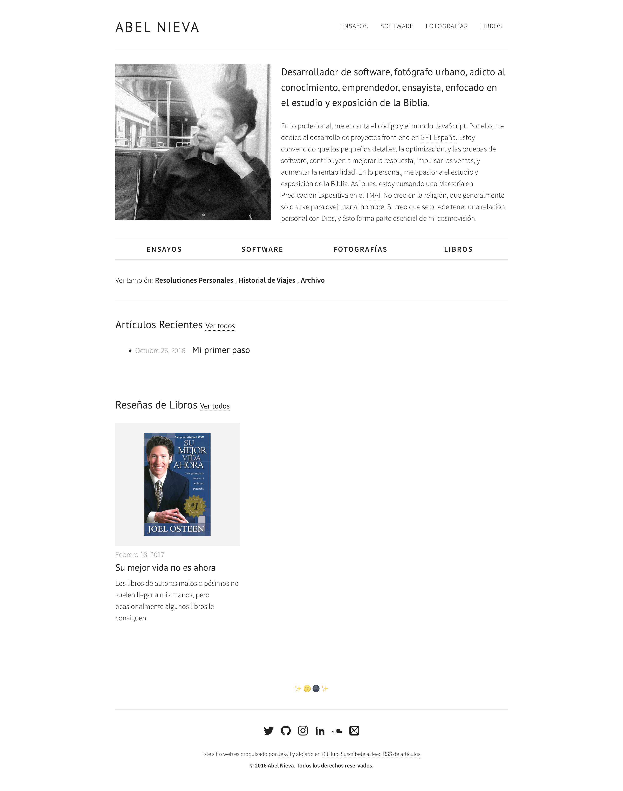

# personal-website

Sample project for a personal website, built with Jekyll and Gulp, applying the BEM methodology.

## License

The theme is available as open source under the terms of the [ISC License](https://opensource.org/licenses/ISC).
